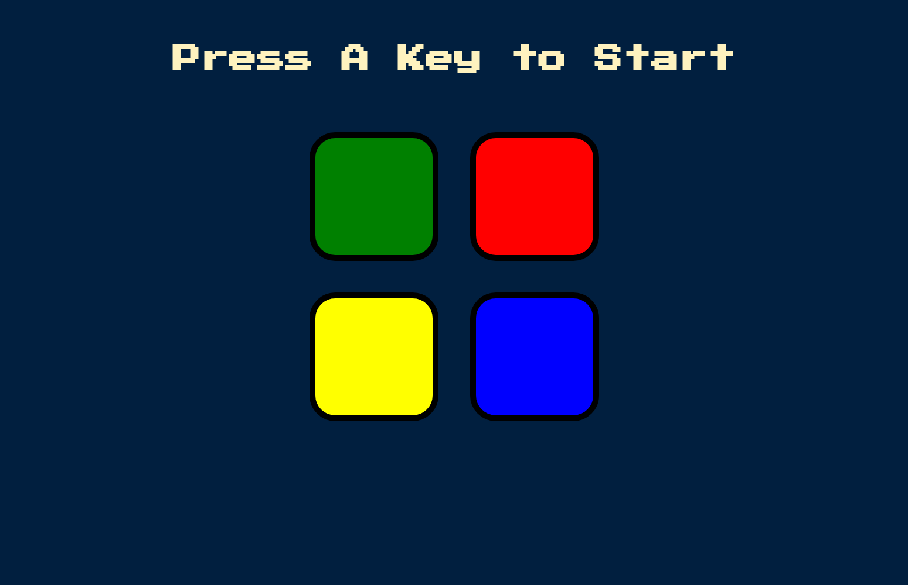

*Credits go out to the App Brewery from who I learned how to build this program 

# Simon-game

Play the game here: [Simon Game](https://raimonvibe.github.io/Simon-game/)

## Description
A web-based implementation of the classic Simon memory game. Test your memory by repeating the sequence of colors and sounds that the game presents.

## How to Play
1. Press any key to start the game
2. Watch and listen to the sequence of colors
3. Repeat the sequence by clicking the colored buttons
4. Each successful round adds one more step to the sequence
5. Make a mistake and the game is over!

## Features
- Four colored buttons (green, red, yellow, blue)
- Sound feedback for each button
- Progressive difficulty as the sequence gets longer
- Immediate feedback on game over

## Technologies Used
- HTML
- CSS
- JavaScript
